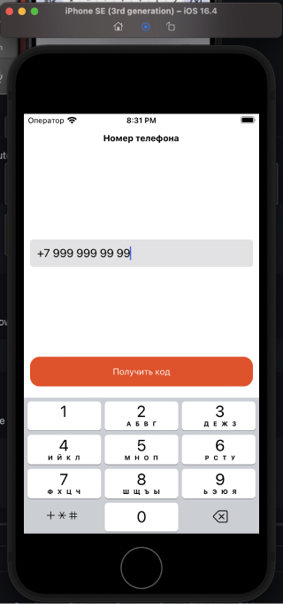

# React and React Native Monorepo

This is a simple monorepo designed for practice and pet projects. A monorepo (mono repository) is a version control setup that consolidates multiple projects into a single repository. These projects can be entirely distinct or share common functionalities and business logic.




## Installation

To get this project up and running, execute the following commands in the root directory, one by one:

### Initialize Project Node Modules

```bash
yarn web-nodeModules
yarn mobile-nodeModules
yarn shared-nodeModules
yarn shared-build
```

### Running the Web App

To start the web application, use the following command:

```bash
yarn web-start
```

### Running the Mobile App

To launch the mobile application, execute these commands:

```bash
yarn mobile-pods
yarn mobile-start
yarn mobile-ios
yarn mobile-android
```

---

Feel free to update and expand upon this README as needed.
